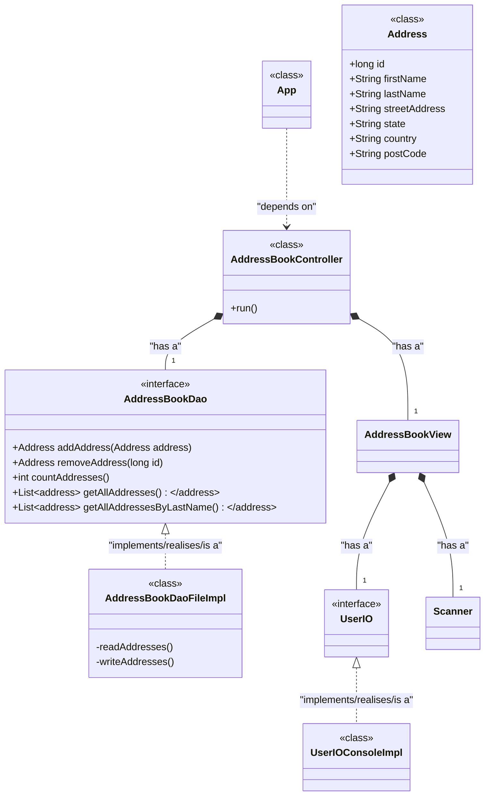

# UML Class Diagram

```mermaid
classDiagram
    
    App ..> AddressBookController : "depends on"
    AddressBookDao <|.. AddressBookDaoFileImpl : "implements/realises/is a"
    UserIO <|.. UserIOConsoleImpl : "implements/realises/is a"

    AddressBookController *-- "1" AddressBookDao : "has a"
    AddressBookController *-- "1" AddressBookView : "has a"
    AddressBookView *-- "1" Scanner : "has a"
    AddressBookView *-- "1" UserIO : "has a"
    
    class App {
        <<class>>
    }
    
    class AddressBookController {
        <<class>>
        
        +run()
    }

    class AddressBookDao {
        <<interface>>
        
        +Address addAddress(Address address)
        +Address removeAddress(long id)
        +int countAddresses()
        +List<Address> getAllAddresses()
        +List<Address> getAllAddressesByLastName()
    }

    class AddressBookDaoFileImpl {
        <<class>>
        
        -readAddresses()
        -writeAddresses()
    }

    class Address {
        <<class>>
        
        +long id
        +String firstName
        +String lastName
        +String streetAddress
        +String state
        +String country
        +String postCode
    }

    class UserIO {
        <<interface>>
    }

    class UserIOConsoleImpl {
        <<class>>
    }

```